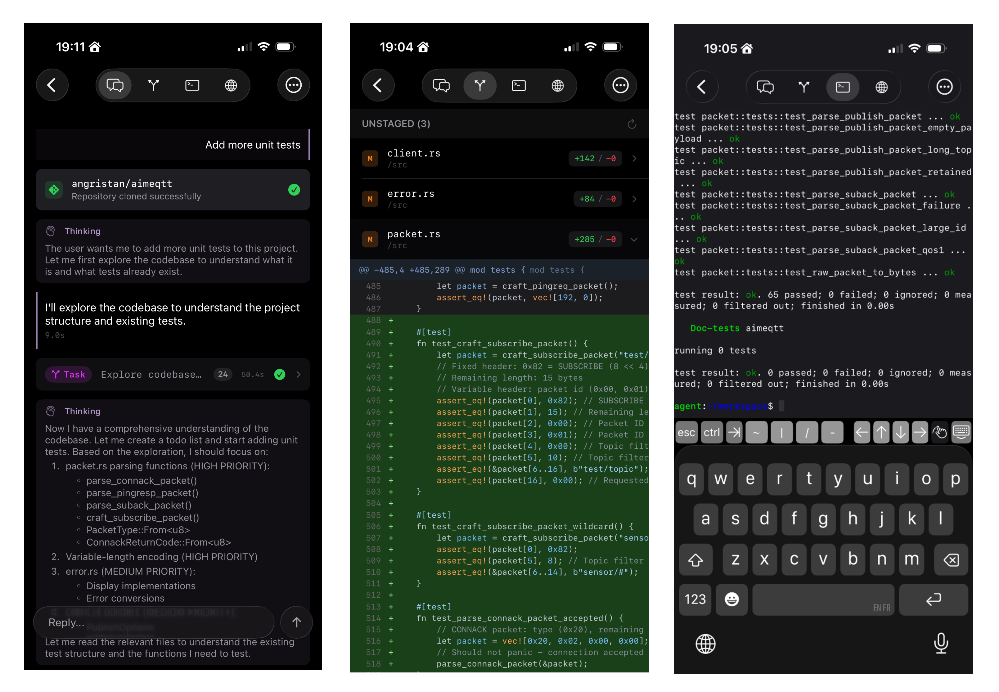
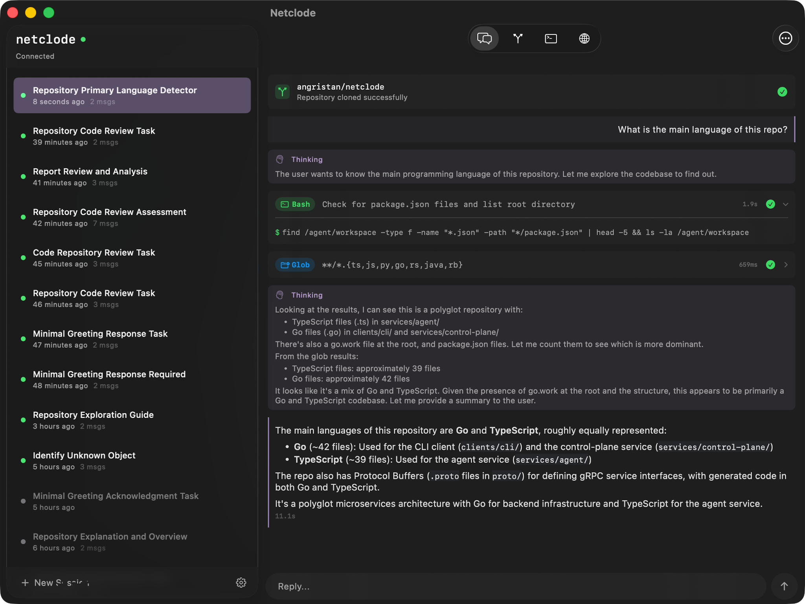
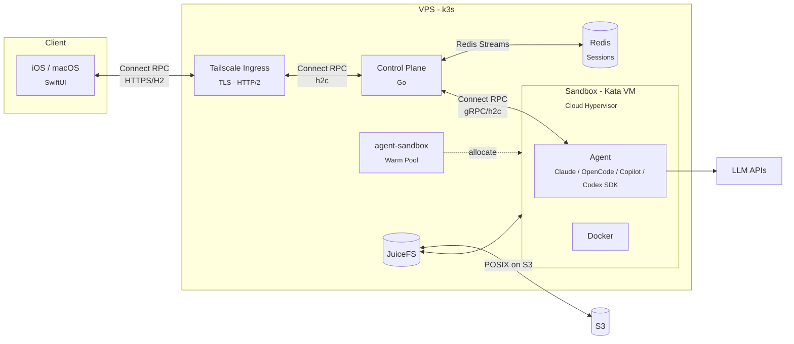

# Netclode

<p align="center">
  
</p>
<p align="center">
Self-hosted coding agent with microVM sandboxes and a native iOS and macOS app.
</p>

<p align="center">
  
  
</p>

## Why I built this

I wanted a self-hosted Claude Code environment I can use from my phone, with the UX I actually want. The existing cloud coding agents were a bit underwhelming when I tried them, so I built my own!

I wrote a blog post about how it works: [Building a self-hosted cloud coding agent](https://stanislas.blog/2026/02/netclode-self-hosted-cloud-coding-agent/).

## What makes it nice

- **Full yolo mode** - Docker, root access, install anything. The microVM handles isolation
- **Local inference with Ollama** - Run models on your own GPU, nothing leaves your machine
- **Tailnet integration** - Preview URLs, port forwarding, access to my infra through Tailscale
- **JuiceFS for storage** - Storage offloaded to S3. Paused sessions cost nothing but storage
- **Live terminal access** - Drop into the sandbox shell from the app
- **Session history** - Auto-snapshots after each turn. Roll back workspace and chat to any previous point
- **GitHub integration** - Clone private repos, push commits, create PRs. Per-repo scoped tokens generated on demand via a GitHub App
- **Multiple SDKs & providers** - Claude Code, OpenCode, Copilot, Codex SDKs with Anthropic, OpenAI, Mistral, Ollama, and more
- **Secrets can't be stolen** - API keys never enter the sandbox. A proxy injects them on the fly for allowed hosts

## How it works



The control plane grabs a pre-booted Kata VM from the warm pool (so it's instant), forwards prompts to the agent SDK inside, and streams responses back. Redis persists events so clients can reconnect without losing anything.

When pausing, the VM is deleted but JuiceFS keeps everything in S3: workspace, installed tools, Docker images, SDK session. Resume mounts the same storage and the conversation continues as if nothing happened. Dozens of paused sessions cost practically nothing.

## Stack

| Layer             | Technology                         | Purpose                                      |
| ----------------- | ---------------------------------- | -------------------------------------------- |
| **Host**          | Linux VPS + Ansible                | Provisioned via playbooks                    |
| **Orchestration** | k3s                                | Lightweight Kubernetes, nice for single-node |
| **Isolation**     | Kata Containers + Cloud Hypervisor | MicroVM per agent session                    |
| **Storage**       | JuiceFS → S3                       | POSIX filesystem on object storage           |
| **State**         | Redis (Streams)                    | Real-time, streaming session state           |
| **Network**       | Tailscale Operator                 | VPN to host, ingress, sandbox previews       |
| **API**           | Protobuf + Connect RPC             | Type-safe, gRPC-like, streams                |
| **Control Plane** | Go                                 | Session and sandbox orchestration            |
| **Agent**         | TypeScript/Node.js                 | SDK runner inside sandbox                    |
| **Secret Proxy**  | Go                                 | Injects API keys outside the sandbox         |
| **Local LLM**     | Ollama                             | Optional, local models on GPU                |
| **Client**        | SwiftUI (iOS 26)                   | Native iOS/macOS app                         |
| **CLI**           | Go                                 | Debug client for development                 |

## Project structure

```
netclode/
├── clients/
│   ├── ios/              # iOS/Mac app (SwiftUI)
│   └── cli/              # Debug CLI (Go)
├── services/
│   ├── control-plane/    # Session orchestration (Go)
│   ├── agent/            # SDK runner (Node.js)
│   │   └── auth-proxy/   # Adds SA token to requests (Go)
│   └── secret-proxy/     # Injects real API keys (Go)
├── proto/                # Protobuf definitions
├── infra/
│   ├── ansible/          # Server provisioning
│   └── k8s/              # Kubernetes manifests
└── docs/
```

## Getting started

See [docs/deployment.md](docs/deployment.md) for full setup. I tried to make it as easy as possible: ideally a single playbook run.

Quick version:

1. Provision a VPS with nested virtualization support
2. Run Ansible playbooks to provision the server
3. Configure secrets (API keys, S3 credentials, Tailscale OAuth)
4. Deploy k8s manifests
5. Connect via Tailscale and you're good to go

## Docs

- [Deployment](docs/deployment.md) - Full setup
- [Operations](docs/operations.md) - Day-to-day management
- [Sandbox Architecture](docs/sandbox-architecture.md) - Kata VMs, JuiceFS, warm pool
- [Session Lifecycle](docs/session-lifecycle.md) - How sessions work
- [Session History](docs/session-history.md) - Snapshots and rollback
- [GitHub Integration](docs/github-integration.md) - Clone repos and push commits
- [Network Access](docs/network-access.md) - Internet and Tailnet access control
- [Secret Proxy](docs/secret-proxy.md) - API key protection architecture
- [Web Previews](docs/web-previews.md) - Port exposure via Tailscale
- [Terminal](docs/terminal.md) - Live shell access
- [SDK Support](docs/sdk-support.md) - Claude, OpenCode, Copilot, Codex
- [Agent Events](docs/agent-events.md) - Event types and streaming
- [iOS App](clients/ios/README.md)
- [CLI](clients/cli/README.md) - Debug CLI
- [Control Plane](services/control-plane/README.md)
- [Agent](services/agent/README.md)
- [Infrastructure](infra/k8s/README.md)

## Demo

All videos from the [blog post](https://stanislas.blog/2026/02/netclode-self-hosted-cloud-coding-agent/):

#### Warm pool instant start

No cold start, sandboxes are pre-booted

<p align="center"><video src="https://github.com/user-attachments/assets/66bd86fb-5ffc-483a-bca2-ddbe6c9b3058" controls muted loop></video></p>

#### Session pause & resume

Older sessions are automatically paused to save resources. Resume brings everything back instantly

<p align="center"><video src="https://github.com/user-attachments/assets/1900d2a0-cc6a-4d7c-a27e-10e528ded2e3" controls muted loop></video></p>

#### Local inference with Ollama

Run models on your own GPU

<p align="center"><video src="https://github.com/user-attachments/assets/6104b384-c337-41d1-8f06-de0e9bd98377" controls muted loop></video></p>

#### CLI shell

Instant sandbox access from the terminal, inspired by [sprites.dev](https://sprites.dev)

<p align="center"><video src="https://github.com/user-attachments/assets/5538604d-c74e-43f0-800a-cd3a65f57a54" controls muted loop></video></p>

<table>
<tr>
<td align="center"><strong>Git diff view</strong><br>Diff view with multi-repo support<br><br><video src="https://github.com/user-attachments/assets/ab712aad-a25e-49b0-a04a-a766535949c3" controls muted loop></video></td>
<td align="center"><strong>Live terminal</strong><br>Drop into the sandbox shell from iOS<br><br><video src="https://github.com/user-attachments/assets/de2572e1-cf8d-4c5c-9ff3-56d690546848" controls muted loop></video></td>
</tr>
<tr>
<td align="center"><strong>Speech input</strong><br>Speech recognition for prompts<br><br><video src="https://github.com/user-attachments/assets/8d21c5fd-19e3-4680-8581-27048dd229d0" controls muted loop></video></td>
<td align="center"><strong>Tailscale port preview</strong><br>Expose sandbox ports to the tailnet<br><br><video src="https://github.com/user-attachments/assets/6b7ca00f-83fe-4365-be2a-686b553b3a91" controls muted loop></video></td>
</tr>
</table>

