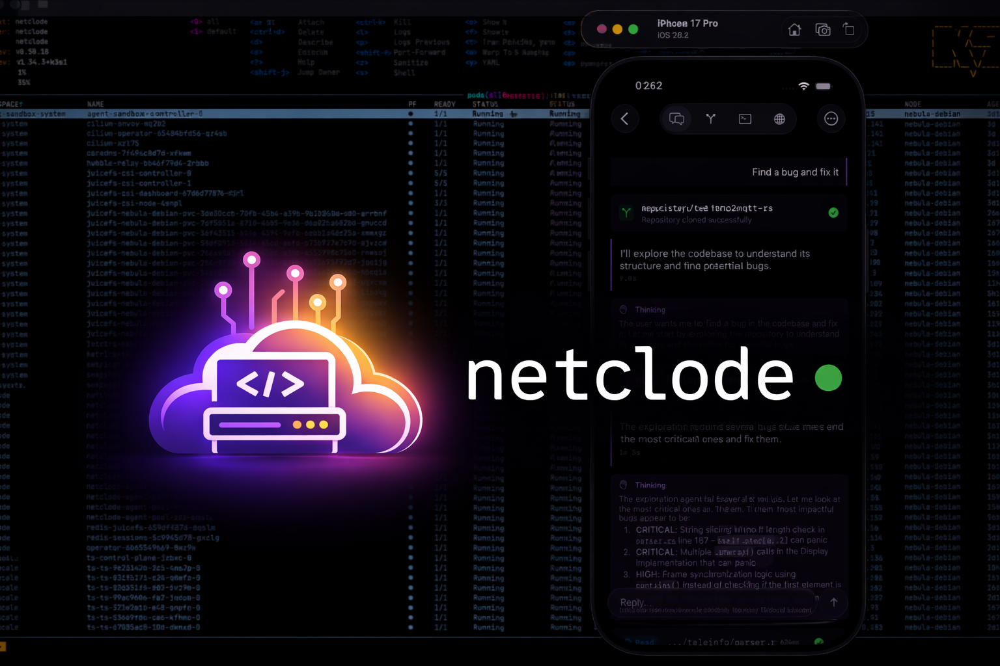
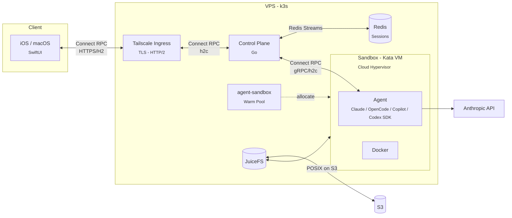

# Netclode



Self-hosted cloud coding agent with microVM isolation, session persistence, and a native iOS app.

<p align="center">
  
</p>

## Why I built this

I wanted a self-hosted Claude Code environment I can use from my phone, with the UX I actually want.

## What makes it nice

- **Full YOLO mode** - Docker, root access, install anything. The microVM handles isolation.
- **Tailnet integration** - Preview URLs, port forwarding, access to my infra through Tailscale.
- **JuiceFS for storage** - Storage offloaded to S3. Paused sessions cost nothing but storage.
- **Live terminal access** - Drop into the sandbox shell from the app.
- **Session history** - Auto-snapshots after each turn. Roll back workspace and chat to any previous point.
- **Multiple SDKs** - Claude Code, OpenCode, Copilot, Codex. Swap anytime.

## How it works



The control plane grabs a pre-booted Kata VM from the warm pool (instant start), forwards prompts to the agent SDK inside, and streams responses back in real-time. Redis persists events so clients can reconnect without losing anything.

When pausing, the VM is deleted but JuiceFS keeps everything in S3 - workspace, tools, Docker images, SDK session. Resume mounts the same storage and the conversation continues as if nothing happened. Dozens of paused sessions cost practically nothing.

## Stack

| Layer             | Technology                         | Purpose                                   |
| ----------------- | ---------------------------------- | ----------------------------------------- |
| **Host**          | Linux VPS + Ansible                | Provisioned via playbooks                 |
| **Orchestration** | k3s                                | Lightweight Kubernetes                    |
| **Isolation**     | Kata Containers + Cloud Hypervisor | MicroVM per agent, separate kernel        |
| **Storage**       | JuiceFS -> S3                      | POSIX filesystem backed by object storage |
| **State**         | Redis                              | Session state, event persistence, pub/sub |
| **Network**       | Tailscale Operator                 | Zero-config VPN, ingress, DNS             |
| **API**           | Connect Protocol                   | gRPC-compatible, works over HTTP/1.1      |
| **Control Plane** | Go                                 | Session orchestration, API server         |
| **Agent**         | Node.js + Claude/OpenCode/Copilot/Codex SDK | AI agent runtime inside sandbox |
| **Client**        | SwiftUI (iOS 26 Liquid Glass)      | Native iOS/macOS app                      |

## Project structure

```
netclode/
├── clients/
│   ├── ios/              # iOS/Mac app (SwiftUI)
│   └── cli/              # Debug CLI (Go)
├── services/
│   ├── control-plane/    # Session orchestration (Go)
│   └── agent/            # SDK runner (Node.js)
├── infra/
│   ├── ansible/          # Server provisioning
│   └── k8s/              # Kubernetes manifests
└── docs/                 # Setup guides
```

## Getting started

See [docs/deployment.md](docs/deployment.md) for full setup.

Quick version:

1. Provision a VPS with nested virtualization support (DigitalOcean, Vultr)
2. Run Ansible playbooks to provision the server
3. Configure secrets (Anthropic API key, S3 credentials, Tailscale OAuth)
4. Deploy k8s manifests
5. Connect via Tailscale

## Docs

- [Deployment](docs/deployment.md) - Full setup
- [Operations](docs/operations.md) - Day-to-day management
- [Sandbox Architecture](docs/sandbox-architecture.md) - Kata VMs, JuiceFS, warm pool
- [Session Lifecycle](docs/session-lifecycle.md) - How sessions work
- [Session History](docs/session-history.md) - Snapshots and rollback
- [GitHub Integration](docs/github-integration.md) - Clone repos and push commits
- [Network Access](docs/network-access.md) - Internet and Tailnet access control
- [Web Previews](docs/web-previews.md) - Port exposure via Tailscale
- [Terminal](docs/terminal.md) - Live shell access
- [SDK Support](docs/sdk-support.md) - Claude, OpenCode, Copilot, Codex
- [Agent Events](docs/agent-events.md) - Event types and streaming
- [iOS App](clients/ios/README.md)
- [CLI](clients/cli/README.md) - Debug CLI
- [Control Plane](services/control-plane/README.md)
- [Agent](services/agent/README.md)
- [Infrastructure](infra/k8s/README.md)

## License

MIT
