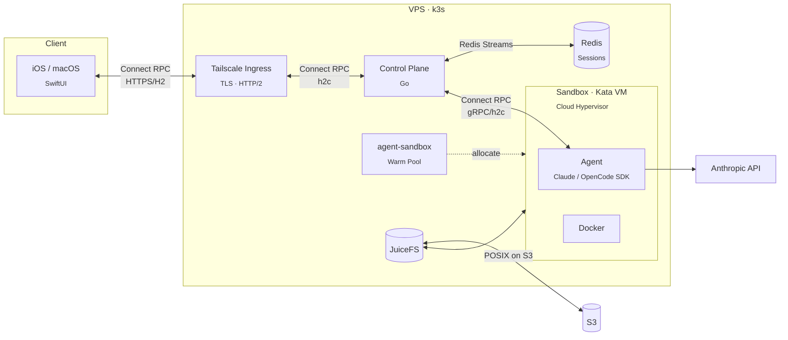
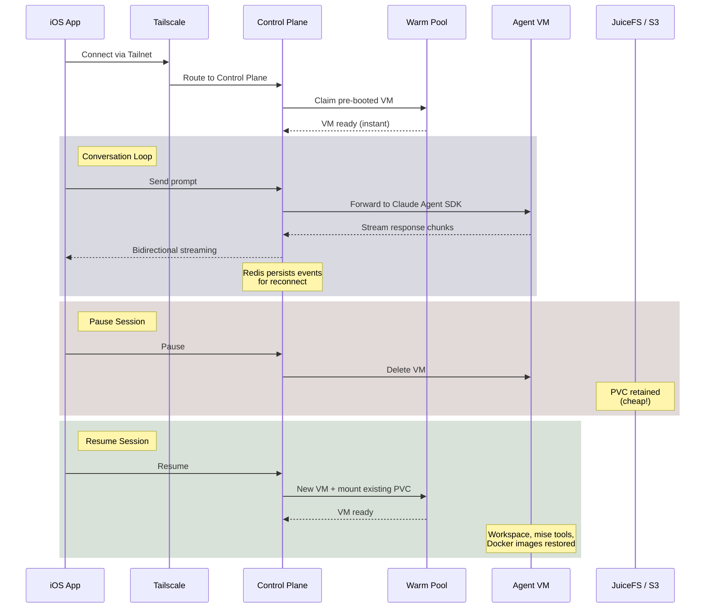

# Netclode

Self-hosted coding agent. Persistent sandboxed sessions accessible from iOS, with full shell/Docker/network access, running on a single VPS with microVM isolation.

> [!NOTE]
> This is experimental and not ready for self-hosting. I'm building it for myself and iterating quickly.

## Why

I wanted a self-hosted Claude Code environment with the UX I actually want:

- **Full YOLO mode** - Docker, root access, install anything. The VM handles isolation.
- **Tailnet integration** - Preview URLs, port forwarding, access to my infra (like my home k8s cluster) through Tailscale.
- **JuiceFS for storage** - Storage offloaded to S3. Paused sessions cost nothing but storage.
- **Live terminal access** - Drop into the sandbox shell from the app. Debug, install tools, run commands.
- **Single-tenant by design** - Optimized for personal use. Architecture scales to multi-node or multi-tenant if needed.

## How it works

### Architecture



### Session lifecycle



**The flow:**

1. **Connect** - iOS app connects via Tailscale to the control plane (Connect protocol, gRPC-compatible)
2. **Allocate** - Control plane grabs a pre-booted Kata VM from the warm pool (instant start)
3. **Prompt** - Messages go to Claude Agent SDK running inside the isolated VM
4. **Stream** - Responses stream back in real-time; Redis persists events for reconnect
5. **Pause** - VM deleted, JuiceFS PVC retained in S3 (workspace, tools, Docker all preserved)
6. **Resume** - New VM mounts same storage, conversation continues exactly where you left off

### Why JuiceFS

JuiceFS is a POSIX filesystem backed by S3:

- **Pause**: VM deleted, PVC retained. Data lives in S3, costs ~$0.01/GB/month.
- **Resume**: New VM mounts the same PVC. Workspace, installed tools, Docker images, SDK session all still there.

Dozens of paused sessions on a small VPS. Only running sessions consume compute.

### Kata Containers

Each agent runs in a Kata Container, a lightweight VM using Cloud Hypervisor. Separate kernel, memory, filesystem per agent.

Why Cloud Hypervisor over Firecracker? Firecracker doesn't support virtiofs, which means you'd need devmapper snapshotter and a more complex storage setup. Cloud Hypervisor + virtiofs is simpler and performs well enough.

### Connect RPC

All communication uses [Connect](https://connectrpc.com/), a gRPC-compatible protocol by Buf. Bidirectional streaming over a single persistent connection enables real-time prompt/response flow. Proto-first API with generated clients for Go, TypeScript, and Swift.

See [proto/README.md](proto/README.md) for schema details and code generation.

### Sandbox CRDs

Sandboxes are managed via custom k8s resources:

- `Sandbox` - A running agent VM
- `SandboxClaim` - Request for a sandbox (can be satisfied from warm pool)
- `SandboxTemplate` - Pod spec + PVC templates for sandboxes
- `SandboxWarmPool` - Maintains N pre-booted VMs ready for instant allocation

The [agent-sandbox-controller](https://github.com/angristan/agent-sandbox) reconciles these. It's a fork of [kubernetes-sigs/agent-sandbox](https://github.com/kubernetes-sigs/agent-sandbox) with additions:

- `volumeClaimTemplates` in SandboxTemplate (upstream only supports ephemeral storage)
- PVC adoption when SandboxClaim binds to a warm pool pod

## Stack

| Layer             | Technology                         | Purpose                                   |
| ----------------- | ---------------------------------- | ----------------------------------------- |
| **Host**          | Linux VPS + Ansible                | Provisioned via Ansible playbooks         |
| **Orchestration** | k3s                                | Lightweight Kubernetes                    |
| **Isolation**     | Kata Containers + Cloud Hypervisor | MicroVM per agent, separate kernel        |
| **Storage**       | JuiceFS → S3                       | POSIX filesystem backed by object storage |
| **State**         | Redis                              | Session state, event persistence, pub/sub |
| **Network**       | Tailscale Operator                 | Zero-config VPN, ingress, DNS             |
| **API**           | Connect Protocol                   | gRPC-compatible, works over HTTP/1.1      |
| **Control Plane** | Go                                 | Session orchestration, API server         |
| **Agent**         | Node.js + Claude/OpenCode SDK      | AI agent runtime inside sandbox           |
| **Client**        | SwiftUI (iOS 26 Liquid Glass)      | Native iOS/macOS app                      |

## Client

Main interface is the **iOS/Mac app** (SwiftUI, iOS 26 Liquid Glass).

## Project structure

```
netclode/
├── clients/
│   ├── ios/              # iOS/Mac app (SwiftUI)
│   └── cli/              # Debug CLI (Go)
├── services/
│   ├── control-plane/    # Session orchestration (Go)
│   └── agent/            # Claude Agent SDK runner (Node.js)
├── infra/
│   ├── ansible/          # Server provisioning
│   └── k8s/              # Kubernetes manifests
└── docs/                 # Setup guides
```

## Getting started

See [docs/deployment.md](docs/deployment.md) for full setup.

Quick version:

1. Provision a VPS with nested virtualization support (DigitalOcean, Vultr)
2. Run Ansible playbooks to provision the server
3. Configure secrets (Anthropic API key, S3 credentials, Tailscale OAuth)
4. Deploy k8s manifests
5. Connect via Tailscale

## Docs

- [Deployment](docs/deployment.md) - Full setup
- [Operations](docs/operations.md) - Day-to-day management
- [GitHub Integration](docs/github-integration.md) - Clone repos and push commits
- [iOS App](clients/ios/README.md)
- [CLI](clients/cli/README.md) - Debug CLI for inspecting sessions
- [Control Plane](services/control-plane/README.md)
- [Agent](services/agent/README.md)
- [Infrastructure](infra/k8s/README.md)

## Future

- Notifications (iOS push, etc.)
- Plan mode
- Custom environment support

## License

MIT
